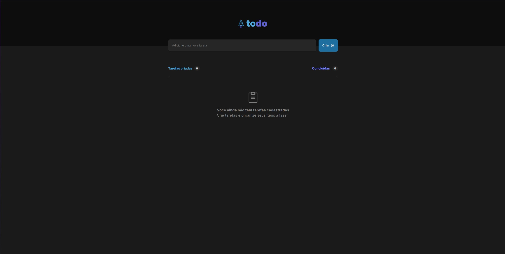
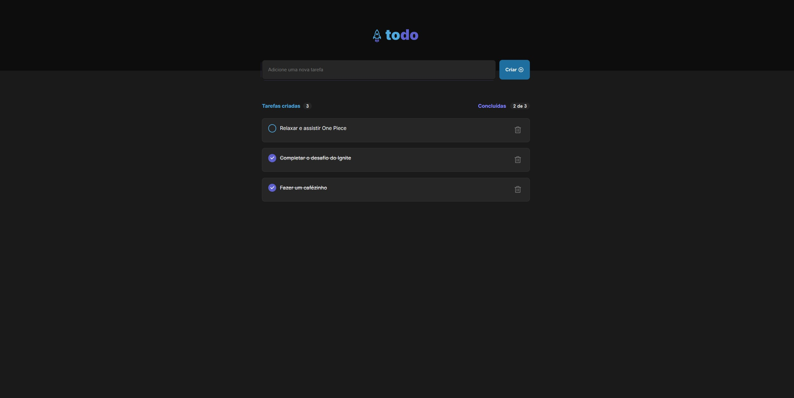

<div align="center">
  <h1>
    
    Todo 
  </h1>

  > Posts feed application for Ignite Bootcamp.

  [](https://peppy-begonia-339603.netlify.app)
</div>

<div align="center">
  
  

  > <small>on dark mode 🌃</small>
</div>

<!-- <div align="center">
  

  > <small>Posts feed on dark mode 🌑</small> -->
</div>

## 💡 You will need

- [Node JS](https://nodejs.org) installed on your host.

## 🎉 Starting

### Clone

In order to clone the project (via HTTPS), run this command:

```bash
git clone 
```

> 💡 SSH URLs provide access to a Git repository via SSH, a secure protocol. If you have a SSH key registered in your Github account, clone the project using this command: `git clone`


Go to project folder:

```bash
cd ignite-feed
```

### Dependencies

Install the project dependencies:

```bash
npm i
```
> You can also run `yarn` instead.
### Develop

Start local development server:

```
npm run dev
```
> You can also run `yarn dev` instead.

## 🤝 Contributing

> Contributions, issues and new features are **always welcome**! You can explore them [here](https://github.com/).

Feel free to submit a new issue with a respective title and description on the the **Ignite Feed** repository. If you already found a solution to your problem, I would love to review your pull request! Have a look at our [contribution guidelines](CONTRIBUTING.md) to find out about the coding standards.


## 📜 License

Released in 2022 © This project is under [MIT License](LICENSE.txt).

## 😃 Author

Made with 💜 by [Juliana Valle](https://github.com/julianahvalle).<br/>
[Get it touch](https://www.linkedin.com/in/julianahvallefrasao/)!
___

<div align="center">
  <strong>Ignite Bootcamp 🔥</strong>
</div>